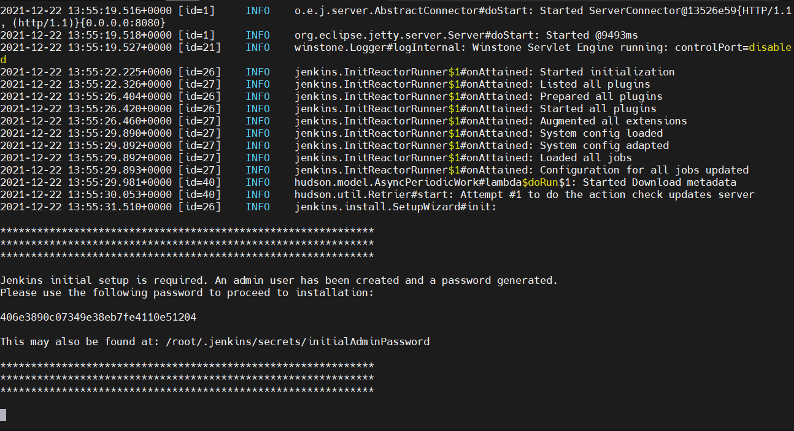
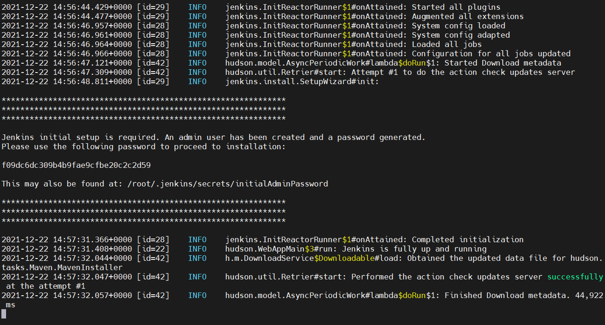

# Домашнее задание к занятию "5.4. Практические навыки работы с Docker"

## Задача 1 

В данном задании вы научитесь изменять существующие Dockerfile, адаптируя их под нужный инфраструктурный стек.

Измените базовый образ предложенного Dockerfile на Arch Linux c сохранением его функциональности.

```text
FROM ubuntu:latest

RUN apt-get update && \
    apt-get install -y software-properties-common && \
    add-apt-repository ppa:vincent-c/ponysay && \
    apt-get update
 
RUN apt-get install -y ponysay

ENTRYPOINT ["/usr/bin/ponysay"]
CMD ["Hey, netology”]
```

Для получения зачета, вам необходимо предоставить:
- Написанный вами Dockerfile
- Скриншот вывода командной строки после запуска контейнера из вашего базового образа
- Ссылку на образ в вашем хранилище docker-hub

```docker
FROM archlinux:latest

RUN pacman -Syy && \
    pacman -S --noconfirm ponysay
 
ENTRYPOINT ["/usr/bin/ponysay"]
CMD ["Hey, netology"]

```  
  

https://hub.docker.com/r/mikhail762/virt541

## Задача 2 

В данной задаче вы составите несколько разных Dockerfile для проекта Jenkins, опубликуем образ в `dockerhub.io` и посмотрим логи этих контейнеров.

- Составьте 2 Dockerfile:

    - Общие моменты:
        - Образ должен запускать [Jenkins server](https://www.jenkins.io/download/)
        
    - Спецификация первого образа:
        - Базовый образ - [amazoncorreto](https://hub.docker.com/_/amazoncorretto)
        - Присвоить образу тэг `ver1` 
    
    - Спецификация второго образа:
        - Базовый образ - [ubuntu:latest](https://hub.docker.com/_/ubuntu)
        - Присвоить образу тэг `ver2` 

- Соберите 2 образа по полученным Dockerfile
- Запустите и проверьте их работоспособность
- Опубликуйте образы в своём dockerhub.io хранилище

Для получения зачета, вам необходимо предоставить:
- Наполнения 2х Dockerfile из задания
- Скриншоты логов запущенных вами контейнеров (из командной строки)
- Скриншоты веб-интерфейса Jenkins запущенных вами контейнеров (достаточно 1 скриншота на контейнер)
- Ссылки на образы в вашем хранилище docker-hub

Первый образ:  
```
FROM amazoncorretto

RUN yum install wget -y && \
wget -O /etc/yum.repos.d/jenkins.repo \
https://pkg.jenkins.io/redhat-stable/jenkins.repo && \
rpm --import https://pkg.jenkins.io/redhat-stable/jenkins.io.key && \
yum upgrade -y && \
amazon-linux-extras install epel -y && \
yum update -y && \
yum install jenkins -y

EXPOSE 8080
CMD ["/usr/bin/java","-jar","/usr/lib/jenkins/jenkins.war"]
```
  

https://hub.docker.com/r/mikhail762/virt5421  

Второй образ:  
```
FROM ubuntu:latest

RUN apt update -y && \
apt install gnupg2 wget -y && \
wget -q -O - https://pkg.jenkins.io/debian-stable/jenkins.io.key | apt-key add - && \
sh -c 'echo deb https://pkg.jenkins.io/debian-stable binary/ > \
/etc/apt/sources.list.d/jenkins.list' && \
apt update -y && \
apt install openjdk-11-jdk -y && \
apt-get install jenkins -y

EXPOSE 8080
CMD ["/usr/bin/java","-jar","/usr/share/jenkins/jenkins.war"]
```
  

https://hub.docker.com/r/mikhail762/virt5422


## Задача 3 

В данном задании вы научитесь:
- объединять контейнеры в единую сеть
- исполнять команды "изнутри" контейнера

Для выполнения задания вам нужно:
- Написать Dockerfile: 
    - Использовать образ https://hub.docker.com/_/node как базовый
    - Установить необходимые зависимые библиотеки для запуска npm приложения https://github.com/simplicitesoftware/nodejs-demo
    - Выставить у приложения (и контейнера) порт 3000 для прослушки входящих запросов  
    - Соберите образ и запустите контейнер в фоновом режиме с публикацией порта

- Запустить второй контейнер из образа ubuntu:latest 
- Создайть `docker network` и добавьте в нее оба запущенных контейнера
- Используя `docker exec` запустить командную строку контейнера `ubuntu` в интерактивном режиме
- Используя утилиту `curl` вызвать путь `/` контейнера с npm приложением  

Для получения зачета, вам необходимо предоставить:
- Наполнение Dockerfile с npm приложением
- Скриншот вывода вызова команды списка docker сетей (docker network cli)
- Скриншот вызова утилиты curl с успешным ответом

```commandline
FROM node

WORKDIR /home/nodejs-demo
RUN git clone https://github.com/simplicitesoftware/nodejs-demo.git .
RUN npm install

EXPOSE 3000

CMD ["npm", "start", "0.0.0.0"]
```  


---

### Как cдавать задание

Выполненное домашнее задание пришлите ссылкой на .md-файл в вашем репозитории.

---
