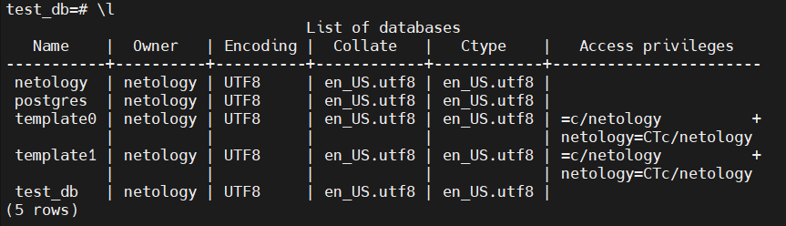
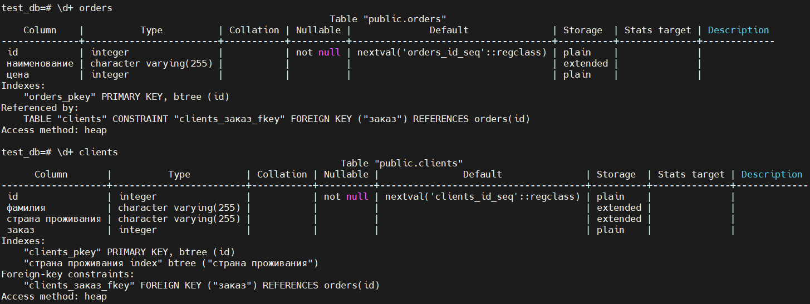
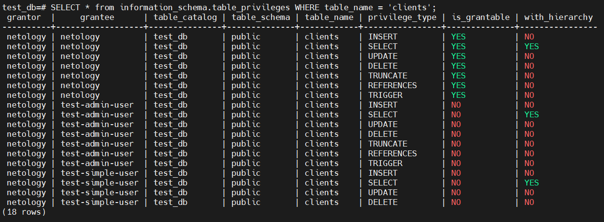
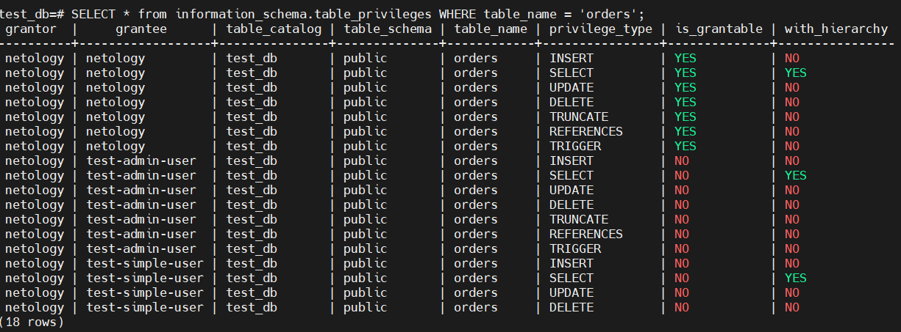
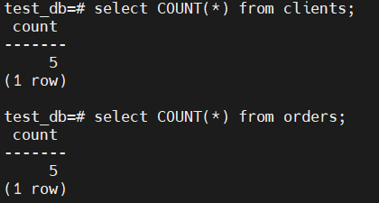
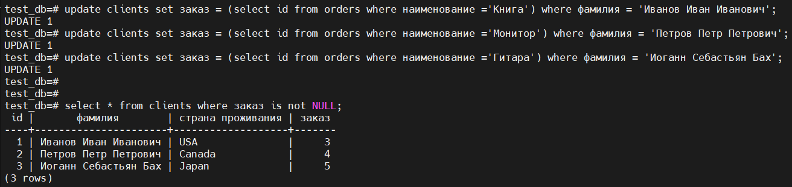

# Домашнее задание к занятию "6.2. SQL"

## Задача 1

Используя docker поднимите инстанс PostgreSQL (версию 12) c 2 volume, 
в который будут складываться данные БД и бэкапы.

Приведите получившуюся команду или docker-compose манифест.  

```
version: "2"
services:
  sqlserver:
    image: postgres:12
    restart: always
    volumes:
      - ./base/:/data/bases
      - ./backup/:/data/backups
    environment:
      - POSTGRES_USER=netology
      - POSTGRES_PASSWORD=netology
    ports:
      - 5432:5432

```


## Задача 2

В БД из задачи 1: 
- создайте пользователя test-admin-user и БД test_db
- в БД test_db создайте таблицу orders и clients (спeцификация таблиц ниже)
- предоставьте привилегии на все операции пользователю test-admin-user на таблицы БД test_db
- создайте пользователя test-simple-user  
- предоставьте пользователю test-simple-user права на SELECT/INSERT/UPDATE/DELETE данных таблиц БД test_db

Таблица orders:
- id (serial primary key)
- наименование (string)
- цена (integer)

Таблица clients:
- id (serial primary key)
- фамилия (string)
- страна проживания (string, index)
- заказ (foreign key orders)

Приведите:
- итоговый список БД после выполнения пунктов выше,  
  
- описание таблиц (describe)  
  
- SQL-запрос для выдачи списка пользователей с правами над таблицами test_db  
```
test_db=# SELECT * from information_schema.table_privileges WHERE table_name = 'clients';
test_db=# SELECT * from information_schema.table_privileges WHERE table_name = 'orders';
```
- список пользователей с правами над таблицами test_db  
    
  

## Задача 3

Используя SQL синтаксис - наполните таблицы следующими тестовыми данными:

Таблица orders

|Наименование|цена|
|------------|----|
|Шоколад| 10 |
|Принтер| 3000 |
|Книга| 500 |
|Монитор| 7000|
|Гитара| 4000|

Таблица clients

|ФИО|Страна проживания|
|------------|----|
|Иванов Иван Иванович| USA |
|Петров Петр Петрович| Canada |
|Иоганн Себастьян Бах| Japan |
|Ронни Джеймс Дио| Russia|
|Ritchie Blackmore| Russia|

Используя SQL синтаксис:
- вычислите количество записей для каждой таблицы 
- приведите в ответе:
    - запросы 
    - результаты их выполнения.  
  


## Задача 4

Часть пользователей из таблицы clients решили оформить заказы из таблицы orders.

Используя foreign keys свяжите записи из таблиц, согласно таблице:

|ФИО|Заказ|
|------------|----|
|Иванов Иван Иванович| Книга |
|Петров Петр Петрович| Монитор |
|Иоганн Себастьян Бах| Гитара |

Приведите SQL-запросы для выполнения данных операций.

Приведите SQL-запрос для выдачи всех пользователей, которые совершили заказ, а также вывод данного запроса.
 
Подсказк - используйте директиву `UPDATE`.  



## Задача 5

Получите полную информацию по выполнению запроса выдачи всех пользователей из задачи 4 
(используя директиву EXPLAIN).

Приведите получившийся результат и объясните что значат полученные значения.  

```
test_db=# EXPLAIN select * from clients where заказ is not NULL;
                         QUERY PLAN
------------------------------------------------------------
 Seq Scan on clients  (cost=0.00..10.70 rows=70 width=1040)
   Filter: ("заказ" IS NOT NULL)
(2 rows)
```
`cost=0.00..10.70` - Первое число - приблизительная стоимость запуска. Это время, которое проходит, прежде чем начнётся этап вывода данных.
Второе - приблизительная общая стоимость. Стоимость обычно измеряется в операциях чтения страницы с диска.  

`rows=70` - Ожидаемое число строк, которое должен вывести этот узел плана. При этом так же предполагается, что узел выполняется до конца.  
`width=1040` - Ожидаемый средний размер строк, выводимых этим узлом плана (в байтах).  


## Задача 6

Создайте бэкап БД test_db и поместите его в volume, предназначенный для бэкапов (см. Задачу 1).  

```
 docker exec -ti test62-sqlserver-1 bash -c 'pg_dump -U netology -W test_db > /data/backups/test_db.dump'
 ```

Остановите контейнер с PostgreSQL (но не удаляйте volumes).  

```
nomad@utom:~/test62$ docker-compose stop
[+] Running 1/1
 ⠿ Container test62-sqlserver-1  Stopped
 ```

Поднимите новый пустой контейнер с PostgreSQL.  

```commandline
nomad@utom:~/test62$ docker run -e POSTGRES_USER=netology -e POSTGRES_PASSWORD=netology -v /home/nomad/test62/backup/:/data/backups -d postgres:12
81b9ee71a4213a5fd9b97fd0b69b3547f42c3d7fa98fa3b84dcb862a7beec009
```

Восстановите БД test_db в новом контейнере.  

```
nomad@utom:~/test62$ docker exec -ti pedantic_gagarin psql -U netology
psql (12.9 (Debian 12.9-1.pgdg110+1))
Type "help" for help.

netology=# CREATE database test_db;
CREATE DATABASE
netology=# CREATE USER "test-admin-user";
CREATE ROLE
netology=# CREATE USER "test-simple-user";
CREATE ROLE
netology=# \q
nomad@utom:~/test62$ docker exec -ti pedantic_gagarin bash 
root@81b9ee71a421:/# psql -U netology test_db < /data/backups/test_db.dump
SET
SET
SET
SET
SET
 set_config
------------

(1 row)

SET
SET
SET
SET
SET
SET
CREATE TABLE
ALTER TABLE
CREATE SEQUENCE
ALTER TABLE
ALTER SEQUENCE
CREATE TABLE
ALTER TABLE
CREATE SEQUENCE
ALTER TABLE
ALTER SEQUENCE
ALTER TABLE
ALTER TABLE
COPY 5
COPY 5
 setval
--------
      5
(1 row)

 setval
--------
      5
(1 row)

ALTER TABLE
ALTER TABLE
CREATE INDEX
ALTER TABLE
GRANT
GRANT
GRANT
GRANT

```
