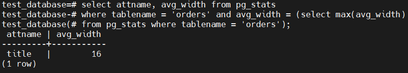

# Домашнее задание к занятию "6.4. PostgreSQL"

## Задача 1

Используя docker поднимите инстанс PostgreSQL (версию 13). Данные БД сохраните в volume.

Подключитесь к БД PostgreSQL используя `psql`.

Воспользуйтесь командой `\?` для вывода подсказки по имеющимся в `psql` управляющим командам.

**Найдите и приведите** управляющие команды для:
- вывода списка БД  
  ``\l[+]   [PATTERN]      list databases``
- подключения к БД  
  ``\c[onnect] {[DBNAME|- USER|- HOST|- PORT|-] | conninfo}
                         connect to new database (currently "netology")``
- вывода списка таблиц  
  ``\d[S+]                 list tables, views, and sequences``
- вывода описания содержимого таблиц  
  ``\d[S+]  NAME           describe table, view, sequence, or index``
- выхода из psql  
  `` \q                     quit psql``

## Задача 2

Используя `psql` создайте БД `test_database`.

Изучите [бэкап БД](https://github.com/netology-code/virt-homeworks/tree/master/06-db-04-postgresql/test_data).

Восстановите бэкап БД в `test_database`.

Перейдите в управляющую консоль `psql` внутри контейнера.

Подключитесь к восстановленной БД и проведите операцию ANALYZE для сбора статистики по таблице.

Используя таблицу [pg_stats](https://postgrespro.ru/docs/postgresql/12/view-pg-stats), найдите столбец таблицы `orders` 
с наибольшим средним значением размера элементов в байтах.

**Приведите в ответе** команду, которую вы использовали для вычисления и полученный результат.  



## Задача 3

Архитектор и администратор БД выяснили, что ваша таблица orders разрослась до невиданных размеров и
поиск по ней занимает долгое время. Вам, как успешному выпускнику курсов DevOps в нетологии предложили
провести разбиение таблицы на 2 (шардировать на orders_1 - price>499 и orders_2 - price<=499).

Предложите SQL-транзакцию для проведения данной операции.  

```
test_database=# create table orders_1 (check (price > 499)) inherits (orders);
test_database=# create table orders_2 (check (price <= 499)) inherits (orders);
test_database=# insert into orders_1 (select * from orders where price>499);
test_database=# insert into orders_2 (select * from orders where price<=499);  
test_database=# create rule insert_1 AS ON INSERT TO orders WHERE (price > 499) DO INSTEAD INSERT INTO orders_1 VALUES (new.*);
test_database=# create rule insert_2 AS ON INSERT TO orders WHERE (price <= 499) DO INSTEAD INSERT INTO orders_2 VALUES (new.*);
```

Можно ли было изначально исключить "ручное" разбиение при проектировании таблицы orders?  

```
CREATE TABLE orders (  
id integer NOT NULL, title character varying(80) NOT NULL,  
price integer DEFAULT 0 PARTITION BY RANGE(price));  
CREATE TABLE orders_2 PARTITION OF orders FOR VALUES FROM (MINVALUE) TO (499);  
CREATE TABLE orders_1 PARTITION OF orders FOR VALUES FROM (500) TO (MAXVALUE);  
```


## Задача 4

Используя утилиту `pg_dump` создайте бекап БД `test_database`.

Как бы вы доработали бэкап-файл, чтобы добавить уникальность значения столбца `title` для таблиц `test_database`?
Добавить строку  
``ALTER TABLE public.orders ADD CONSTRAINT title_unique UNIQUE (title);``

---

### Как cдавать задание

Выполненное домашнее задание пришлите ссылкой на .md-файл в вашем репозитории.

---
